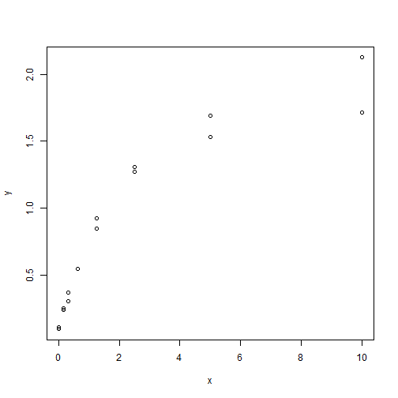
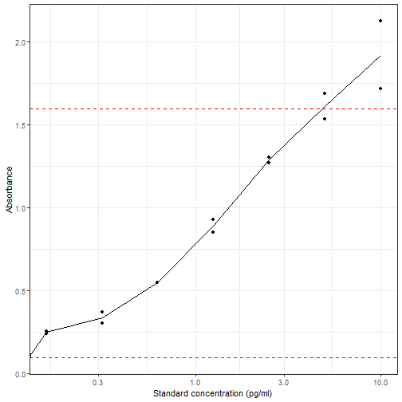
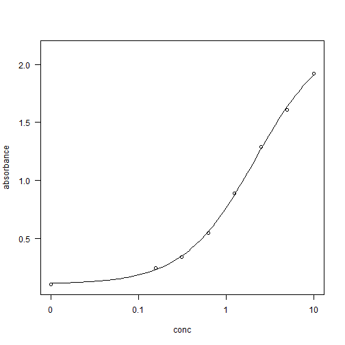
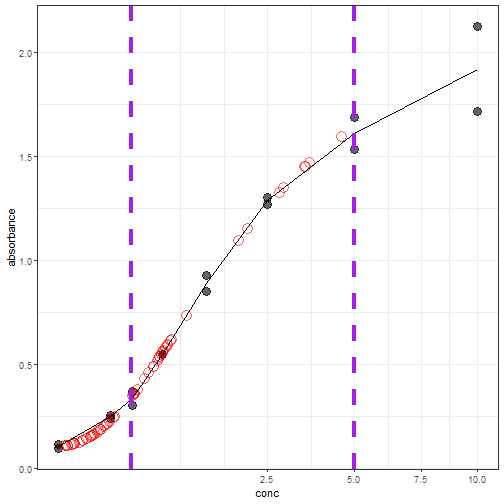
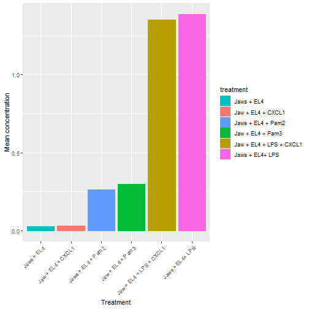

# Elisa data analysis - concept
# Marc Teunis, Annemarie Stam
# Date July 2018

Date of last change 2019-05-29 10:07:47

## Packages


```r
library(lmtest)
library(sandwich)
library(drc)
library(tidyverse)
```

## Read data
Reads the data for the calibration curve


```r
calibration_df <- readxl::read_excel(
  path = here::here(
    "./data-raw/170217 - TNF ELISA.xlsx"),
    sheet = "calibration_data")
calibration_df
```

```
## # A tibble: 16 x 4
##    label   conc absorbance `repeat`
##    <chr>  <dbl>      <dbl>    <dbl>
##  1 ST 1  10          2.12         1
##  2 St 2   5          1.69         1
##  3 ST 3   2.5        1.27         1
##  4 ST 4   1.25       0.927        1
##  5 ST 5   0.625      0.548        1
##  6 ST 6   0.312      0.374        1
##  7 ST 7   0.156      0.256        1
##  8 Blanc  0          0.116        1
##  9 ST 1  10          1.72         2
## 10 St 2   5          1.53         2
## 11 ST 3   2.5        1.31         2
## 12 ST 4   1.25       0.851        2
## 13 ST 5   0.625      0.548        2
## 14 ST 6   0.312      0.307        2
## 15 ST 7   0.156      0.243        2
## 16 Blanc  0          0.1          2
```

Reads the data for the samples (absorbance)


```r
samples_df <- readxl::read_excel(
  path = here::here(
    "./data-raw/170217 - TNF ELISA.xlsx"),
    sheet = "sample_data")
samples_df
```

```
## # A tibble: 72 x 4
##    treatment               absorbance `repeat` dilution 
##    <chr>                        <dbl>    <dbl> <chr>    
##  1 Jaws + EL4                   0.146        1 undiluted
##  2 Jaws + EL4+ LPS              1.33         1 undiluted
##  3 Jaws + EL4 + Pam2            0.532        1 undiluted
##  4 Jaw + EL4 + Pam3             0.54         1 undiluted
##  5 Jaw + EL4 + CXCL1            0.135        1 undiluted
##  6 Jaw + EL4 + LPS + CXCL1      1.10         1 undiluted
##  7 Jaws + EL4                   0.129        2 undiluted
##  8 Jaws + EL4+ LPS              1.35         2 undiluted
##  9 Jaws + EL4 + Pam2            0.462        2 undiluted
## 10 Jaw + EL4 + Pam3             0.52         2 undiluted
## # ... with 62 more rows
```

## Calibration curves
Quick calibration curve


```r
x <- calibration_df$conc
y <- calibration_df$absorbance
plot(y ~ x)
```



Get absorbance range for samples


```r
sample_absorbance_range <- c(min(samples_df$absorbance),
                               max(samples_df$absorbance))
sample_absorbance_range
```

```
## [1] 0.097 1.595
```

Calibration curve with ggplot2


```r
  calibration_df %>%
    ggplot(aes(x = conc, y = absorbance)) +
      geom_point() +
      geom_line(data = calibration_df %>%
                group_by(conc) %>%
                summarise(mean_abs = mean(absorbance)),
              aes(x = conc, y = mean_abs)) +
      scale_x_log10() +
      ylab("Absorbance") +
      xlab("Standard concentration (pg/ml)") +
    geom_hline(yintercept = sample_absorbance_range[1],
               color = "red", linetype = "dashed") +
    geom_hline(yintercept = sample_absorbance_range[2],
               color = "red", linetype = "dashed") +
    theme_bw()
```

```
## Warning: Transformation introduced infinite values in continuous x-axis

## Warning: Transformation introduced infinite values in continuous x-axis
```



## Model predictions using drc package
Define the model with a design formula


```r
model <- drc::drm(absorbance ~ conc,
                  fct = drc:::LL.4(),
                  data = calibration_df)
summary(model)
```

```
## 
## Model fitted: Log-logistic (ED50 as parameter) (4 parms)
## 
## Parameter estimates:
## 
##                Estimate Std. Error t-value   p-value    
## b:(Intercept) -1.072795   0.187893 -5.7096 9.764e-05 ***
## c:(Intercept)  0.110824   0.060318  1.8373  0.091038 .  
## d:(Intercept)  2.253525   0.233198  9.6636 5.177e-07 ***
## e:(Intercept)  2.143045   0.527377  4.0636  0.001572 ** 
## ---
## Signif. codes:  0 '***' 0.001 '**' 0.01 '*' 0.05 '.' 0.1 ' ' 1
## 
## Residual standard error:
## 
##  0.09384775 (12 degrees of freedom)
```

```r
drc:::plot.drc(model)
```



## Estimating the sample concentrations via the models


```r
predicted <- ED(model,
               respLev = samples_df$absorbance,
               type = 'absolute') %>%
    as.data.frame()
```

```
## Warning in log((100 - p)/100): NaNs produced

## Warning in log((100 - p)/100): NaNs produced

## Warning in log((100 - p)/100): NaNs produced

## Warning in log((100 - p)/100): NaNs produced

## Warning in log((100 - p)/100): NaNs produced
```

```
## 
## Estimated effective doses
## 
##            Estimate Std. Error
## e:1:0.146 0.0472188  0.0240728
## e:1:1.33  2.7762881  0.7822316
## e:1:0.532 0.5768612  0.0971745
## e:1:0.54  0.5896229  0.0987456
## e:1:0.135 0.0331279  0.0188497
## e:1:1.095 1.8407932  0.4174162
## e:1:0.129 0.0253260  0.0155558
## e:1:1.352 2.8871200  0.8297148
## e:1:0.462 0.4691956  0.0851514
## e:1:0.52  0.5579016  0.0949036
## e:1:0.144 0.0446718  0.0231859
## e:1:1.595 4.5708558  1.6303808
## e:1:0.159 0.0636703  0.0293193
## e:1:1.473 3.6013656  1.1527216
## e:1:0.568 0.6350816  0.1046388
## e:1:0.594 0.6784452  0.1107164
## e:1:0.157 0.0611485  0.0285634
## e:1:1.453 3.4692601  1.0909284
## e:1:0.166 0.0724794  0.0318417
## e:1:1.451 3.4563923  1.0849562
## e:1:0.582 0.6582895  0.1078345
## e:1:0.621 0.7247157  0.1177152
## e:1:0.157 0.0611485  0.0285634
## e:1:1.153 2.0369380  0.4877974
## e:1:0.122 0.0160454  0.0110976
## e:1:0.562 0.6252345  0.1033218
## e:1:0.189 0.1013341  0.0390534
## e:1:0.254 0.1835151  0.0540157
## e:1:0.114 0.0049484  0.0044200
## e:1:0.561 0.6235990  0.1031052
## e:1:0.136 0.0344186  0.0193634
## e:1:0.551 0.6073326  0.1009853
## e:1:0.226 0.1478926  0.0482918
## e:1:0.245 0.1720170  0.0522684
## e:1:0.113 0.0034767  0.0033171
## e:1:0.618 0.7195101  0.1169009
## e:1:0.119 0.0119740  0.0088795
## e:1:0.539 0.5880223  0.0985466
## e:1:0.207 0.1239332  0.0438384
## e:1:0.216 0.1352651  0.0460151
## e:1:0.097        NA         NA
## e:1:0.493 0.5160193  0.0901360
## e:1:0.118 0.0105982  0.0080805
## e:1:0.598 0.6852188  0.1117075
## e:1:0.203 0.1189050  0.0428280
## e:1:0.217 0.1365260  0.0462492
## e:1:0.097        NA         NA
## e:1:0.494 0.5175518  0.0903048
## e:1:0.114 0.0049484  0.0044200
## e:1:0.382 0.3540081  0.0737268
## e:1:0.177 0.0862873  0.0354724
## e:1:0.188 0.1000801  0.0387682
## e:1:0.113 0.0034767  0.0033171
## e:1:0.362 0.3263582  0.0709723
## e:1:0.12  0.0133396  0.0096462
## e:1:0.434 0.4279949  0.0809878
## e:1:0.189 0.1013341  0.0390534
## e:1:0.183 0.0938109  0.0373073
## e:1:0.102        NA         NA
## e:1:0.737 0.9396039  0.1572284
## e:1:0.121 0.0146964  0.0103845
## e:1:0.357 0.3195111  0.0702783
## e:1:0.162 0.0674486  0.0304228
## e:1:0.188 0.1000801  0.0387682
## e:1:0.109        NA         NA
## e:1:0.364 0.3291043  0.0712491
## e:1:0.121 0.0146964  0.0103845
## e:1:0.364 0.3291043  0.0712491
## e:1:0.169 0.0762483  0.0328693
## e:1:0.191 0.1038423  0.0396172
## e:1:0.105        NA         NA
## e:1:0.355 0.3167794  0.0699997
```

## Add predicted conc to samples data


```r
  samples_df <- samples_df %>%
    mutate(conc = predicted$Estimate) %>%
    mutate(dilution = fct_recode(as_factor(dilution),
          "1" = "undiluted",
          "5" = "5",
          "10" = "10")) %>%
    print()
```

```
## # A tibble: 72 x 5
##    treatment               absorbance `repeat` dilution   conc
##    <chr>                        <dbl>    <dbl> <fct>     <dbl>
##  1 Jaws + EL4                   0.146        1 1        0.0472
##  2 Jaws + EL4+ LPS              1.33         1 1        2.78  
##  3 Jaws + EL4 + Pam2            0.532        1 1        0.577 
##  4 Jaw + EL4 + Pam3             0.54         1 1        0.590 
##  5 Jaw + EL4 + CXCL1            0.135        1 1        0.0331
##  6 Jaw + EL4 + LPS + CXCL1      1.10         1 1        1.84  
##  7 Jaws + EL4                   0.129        2 1        0.0253
##  8 Jaws + EL4+ LPS              1.35         2 1        2.89  
##  9 Jaws + EL4 + Pam2            0.462        2 1        0.469 
## 10 Jaw + EL4 + Pam3             0.52         2 1        0.558 
## # ... with 62 more rows
```

## ggplot2 graph for final results
Here we plot the calibration curve and the samples
to see a graph of all results. The red open circles are
the samples, the grey closed circles represent the
calibration curve. The purple vertical lines represent the
'linear' part of the curve. Some samples fall outside this
range, so probable the experiment needs repeating with
different dilutions of the samples or the amount of
measured cytokine is below the detection limit of the
ELISA assay.


```r
ggplot(data = calibration_df, aes(x = conc, y = absorbance)) +
  geom_point(size = 4, alpha = 0.6) +
  geom_point(data = samples_df, aes(x = conc,
                                    y = absorbance),
             colour = "red",
             shape = 21,
             size = 5,
             alpha = 0.6) +
  geom_line(data = calibration_df %>%
                    group_by(conc) %>%
                    summarise(
                      mean_absorbance = mean(absorbance)
                      ),
                  aes(x = conc, y = mean_absorbance)) +
  scale_x_sqrt() +
  geom_vline(xintercept = 0.31, linetype = "dashed",
                size = 1.5, colour = "purple") +
  geom_vline(xintercept = 5, linetype = "dashed",
             size = 1.5, colour = "purple") +
  theme_bw()
```

```
## Warning: Removed 5 rows containing missing values (geom_point).
```



## Exploratory data analysis


```r
calibration_df
```

```
## # A tibble: 16 x 4
##    label   conc absorbance `repeat`
##    <chr>  <dbl>      <dbl>    <dbl>
##  1 ST 1  10          2.12         1
##  2 St 2   5          1.69         1
##  3 ST 3   2.5        1.27         1
##  4 ST 4   1.25       0.927        1
##  5 ST 5   0.625      0.548        1
##  6 ST 6   0.312      0.374        1
##  7 ST 7   0.156      0.256        1
##  8 Blanc  0          0.116        1
##  9 ST 1  10          1.72         2
## 10 St 2   5          1.53         2
## 11 ST 3   2.5        1.31         2
## 12 ST 4   1.25       0.851        2
## 13 ST 5   0.625      0.548        2
## 14 ST 6   0.312      0.307        2
## 15 ST 7   0.156      0.243        2
## 16 Blanc  0          0.1          2
```

```r
samples_df
```

```
## # A tibble: 72 x 5
##    treatment               absorbance `repeat` dilution   conc
##    <chr>                        <dbl>    <dbl> <fct>     <dbl>
##  1 Jaws + EL4                   0.146        1 1        0.0472
##  2 Jaws + EL4+ LPS              1.33         1 1        2.78  
##  3 Jaws + EL4 + Pam2            0.532        1 1        0.577 
##  4 Jaw + EL4 + Pam3             0.54         1 1        0.590 
##  5 Jaw + EL4 + CXCL1            0.135        1 1        0.0331
##  6 Jaw + EL4 + LPS + CXCL1      1.10         1 1        1.84  
##  7 Jaws + EL4                   0.129        2 1        0.0253
##  8 Jaws + EL4+ LPS              1.35         2 1        2.89  
##  9 Jaws + EL4 + Pam2            0.462        2 1        0.469 
## 10 Jaw + EL4 + Pam3             0.52         2 1        0.558 
## # ... with 62 more rows
```

```r
legend_ord <- samples_df %>%
  dplyr::select(treatment, conc) %>%
  na.omit() %>%
  group_by(treatment) %>%
  summarise(conc = mean(conc)) %>%
  mutate(legend_order = reorder(as_factor(treatment),
                                conc)) %>%
  arrange(conc)

legend <- legend_ord$legend_order

## preprocessing the data for graph -
## summary per experimental group
plot_groups <- samples_df %>%
  dplyr::select(treatment, conc) %>%
  na.omit() %>%
  group_by(treatment) %>%
  summarise(mean_conc = mean(conc)) %>%

## start plot call
  ggplot(aes(x = reorder(as_factor(treatment), mean_conc),
             y = mean_conc)) +
  geom_bar(aes(fill = treatment, color = treatment),
          position = 'dodge', stat = 'identity') +
  theme(axis.text.x = element_text(angle = 45, vjust = 1, hjust=1)) +
  scale_color_discrete(breaks=legend) +
  scale_fill_discrete(breaks=legend) +
  ylab("Mean concentration") +
  xlab("Treatment")


plot_groups
```



